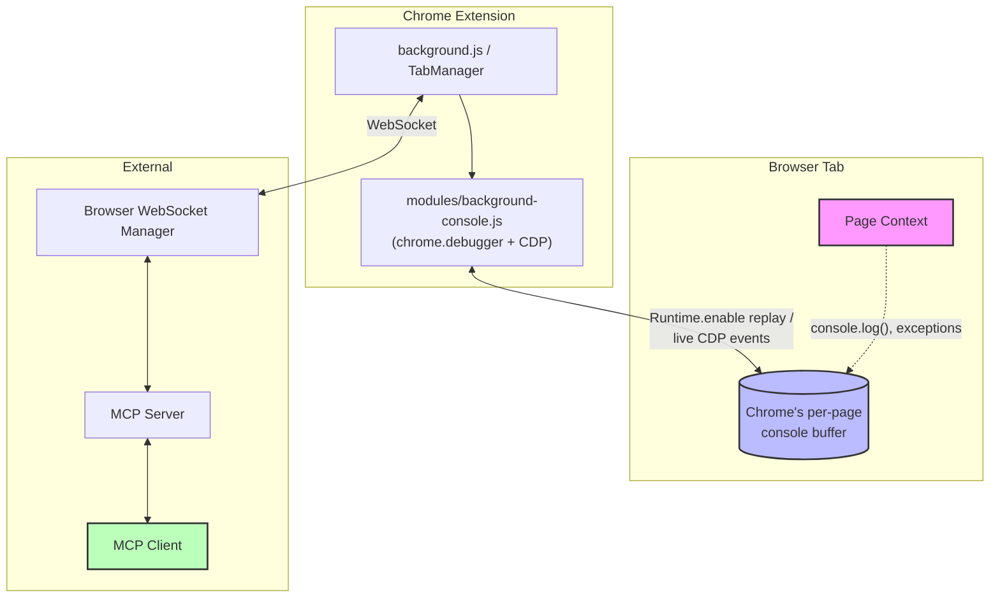
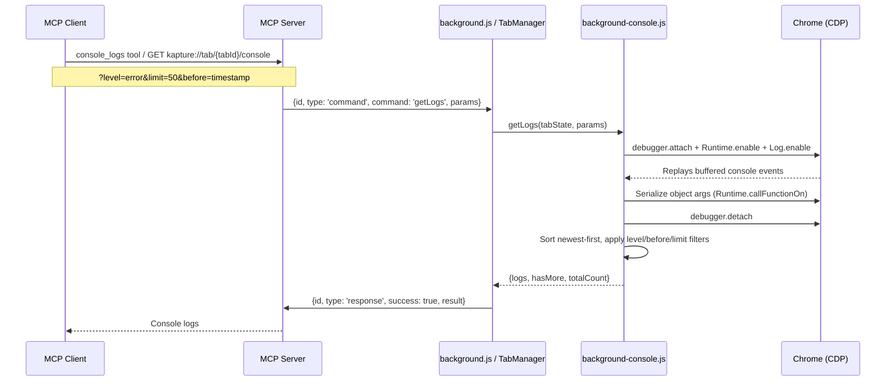
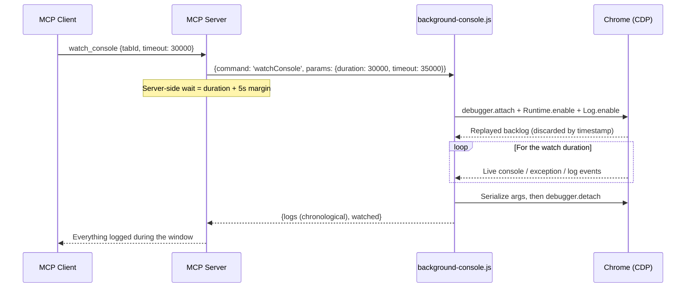

# Console Logs Message Flow

This document describes how Kapture retrieves console logs: on demand via `console_logs`, and live via `watch_console`.

## Overview

Kapture does not capture or store console logs itself. Chrome keeps a per-page console message buffer (the same one DevTools renders when opened after the fact). When a CDP session calls `Runtime.enable`, Chrome replays that buffer to the session. Kapture reads it on demand through `chrome.debugger`:

- **`console_logs`** — attach, enable `Runtime` + `Log`, collect the replayed buffer, detach. Returns what you would see if you opened the DevTools console: console messages, uncaught exceptions, and browser-generated entries (network errors, violations, etc.).
- **`watch_console`** — same attach, but stays attached for a required `timeout` (ms), collecting live events as they happen. The replayed backlog is filtered out by timestamp; only events from the watch window are returned, in chronological order.

Both run in the background service worker (`extension/modules/background-console.js`). DevTools does not need to be open; the debugger infobar shows while attached.

## Architecture Components

### Component Diagram



### CDP Events Consumed

| Event | Produces |
|---|---|
| `Runtime.consoleAPICalled` | Console method calls (`log`, `warn`, `error`, `table`, ...) with full argument serialization |
| `Runtime.exceptionThrown` | Uncaught exceptions and unhandled rejections (`level: 'error'`, with stack trace) |
| `Log.entryAdded` | Browser-generated entries — network errors, CSP violations, deprecations (carries a `source` field) |

Argument serialization happens while still attached: primitives inline; objects are JSON-stringified in the page via `Runtime.callFunctionOn` (circular-safe, functions become source strings).

## `console_logs` Flow



The attach/detach is reference-counted (`attachDebugger()` in `background-commands.js`), so concurrent commands (e.g. a screenshot during a watch) share one debugger session instead of conflicting.

## `watch_console` Flow



The tool call blocks for the full duration — that is the point: "click something, then watch what the page logs for 30 seconds." `timeout` is required (1s–60s; the cap keeps the call under typical MCP client request timeouts).

## Log Entry Shape

```javascript
{
  id: string,          // UUID
  level: string,       // log | info | warn | error | debug | trace | table | group | ...
  args: string[],      // serialized arguments (objects JSON-stringified)
  stackTrace?: string, // for error/warn/trace and exceptions
  source?: string,     // Log.entryAdded only: network, security, violation, ...
  timestamp: string    // ISO 8601, from the original event
}
```

## Characteristics

1. **Mirrors DevTools**: shows the current page's console since its last load — Chrome's buffer is capped at 1000 messages, cleared on navigation and by `console.clear()`. There is no separate Kapture history.
2. **Catches what a console override can't**: uncaught exceptions, unhandled rejections, browser-generated entries, and logs from before Kapture connected.
3. **Undetectable by the page**: no `console.*` wrapping, no injected scripts, no CSP interaction.
4. **Infobar**: the "Kapture is debugging this browser" infobar shows while attached — briefly for `console_logs`, for the full duration of a `watch_console`.
5. **Pull-only**: there are no console push notifications to MCP clients; `watch_console` is the real-time mechanism.

## Error Handling

- **Attach failures** (restricted pages like `chrome://`, tab gone): command returns `CONSOLE_LOG_ERROR` / `WATCH_CONSOLE_ERROR` with the Chrome error message
- **Serialization failures**: per-argument fallback to the CDP `description` preview text
- **External detach** (user dismisses the infobar): the shared session is forgotten via `chrome.debugger.onDetach`; the next command re-attaches
